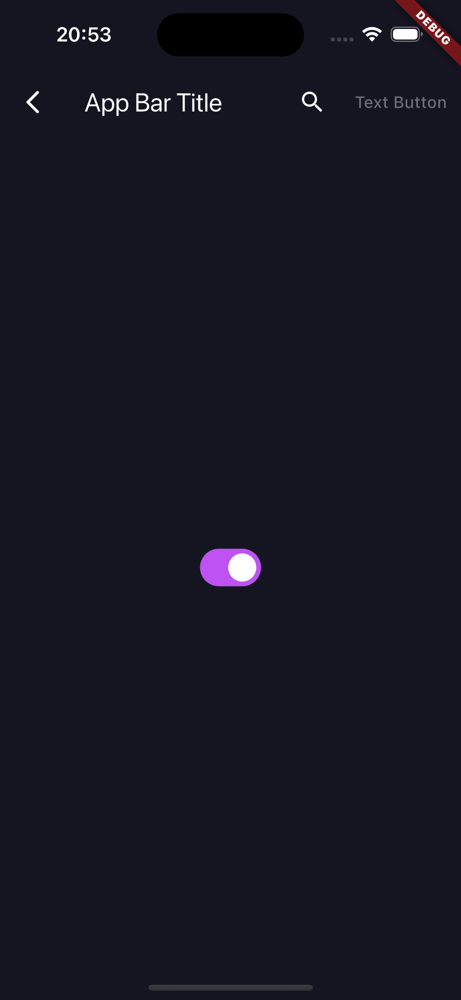
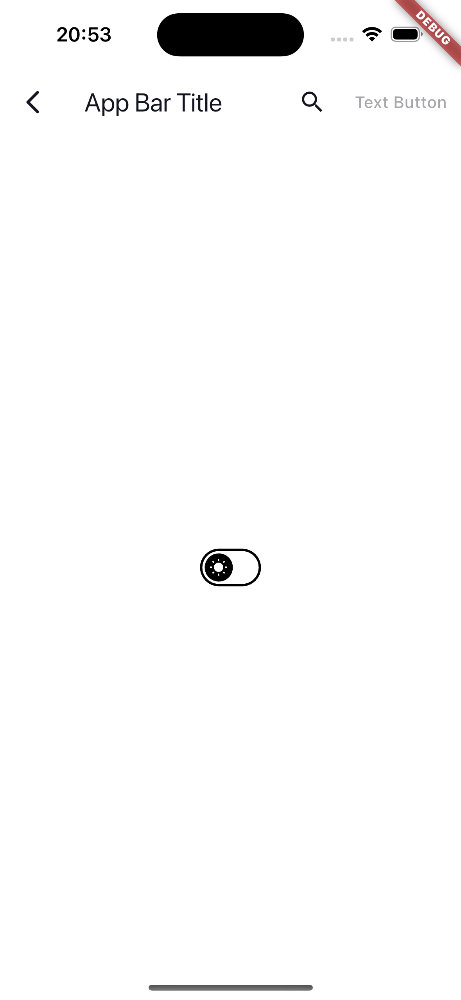
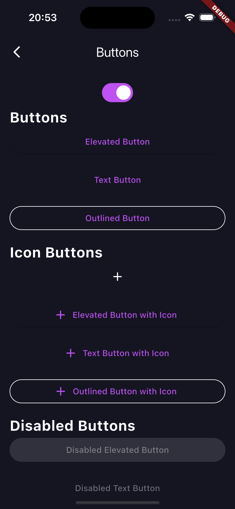
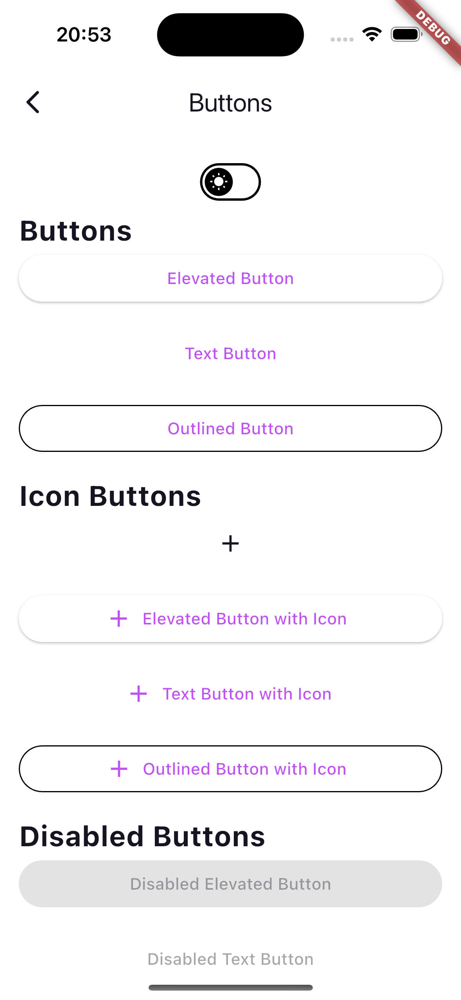
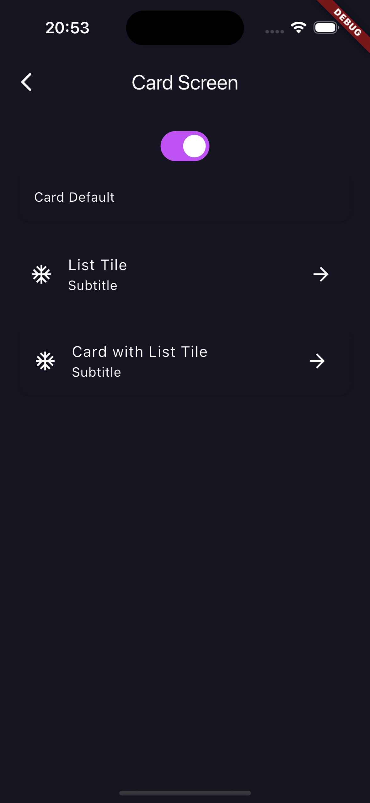
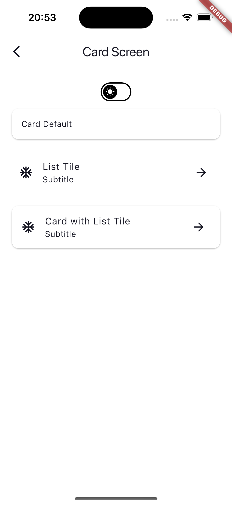
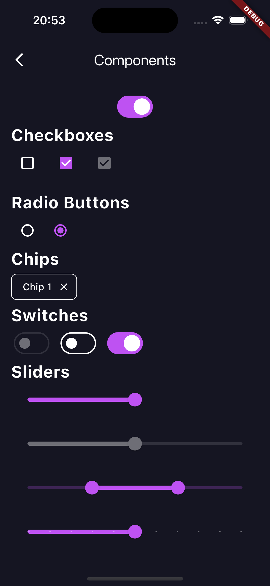
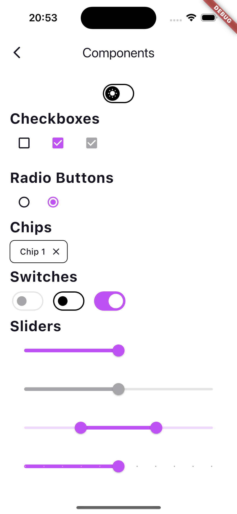

# Theme Exercises for Flutter

I was struggling with implementing themes when using **primaryColor**, **secondaryColor**, **tertiaryColor**, etc. Since there are lots of fields in themes I was getting confused which field would affect which field of my widgets' appearances.
I created this project to see how my changes will change the UI of my app. Also, this project's theme files can be reused in other apps while starting a new project. Standardazing the theme that will be used while implementing design requirements in app development highly increases the speed of development, and mitigates confusions while integrating designs.
The project contains screens for different components of the app. These screens are separated into:

- Button Screen
- Text Screen
- Card Screen
- FAB Screen
- Text Input Screen
- Component Screen
- App Bar Screen
- Shadow Screen.

In these screens mostly used widgets defined by Flutter are laid out and changes on theme data will be reflected in these screens.
The project also separated **dark** and **light** themes into different folder and files so that reimplementing these fields will be easy to implement.

I defined the folders as following structure:

```
lib/ui/core/
└── themes
    ├── app_animations.dart
    ├── colors
    │   ├── app_colors.dart
    │   ├── dark_colors.dart
    │   └── light_colors.dart
    ├── dimens.dart
    └── theme
        ├── app_theme.dart
        ├── dark
        │   └── dark_theme.dart
        └── light
            └── light_theme.dart
```

- **app_animatios.dart** contains animations, curves that will be used commonly in the app.
- **colors** folder contains app's colors with **dark** and **light** color schemes.
- **dimens.dart** contains dimensions, **sizes**, **border**, **border radius** and etc. fields that are used in the app.
- **theme** folder contains theme datas of the app. These are text themes, button themes, card themes, etc. Themes are also differentiated into **dark** and **light** schemes.

## Screenshots

### App Bar

<p align="center">
  
  
</p>

### Buttons

<p align="center">
  
  
</p>

### Cards

<p align="center">
  
  
</p>

### Components

<p align="center">
  
  
</p>
